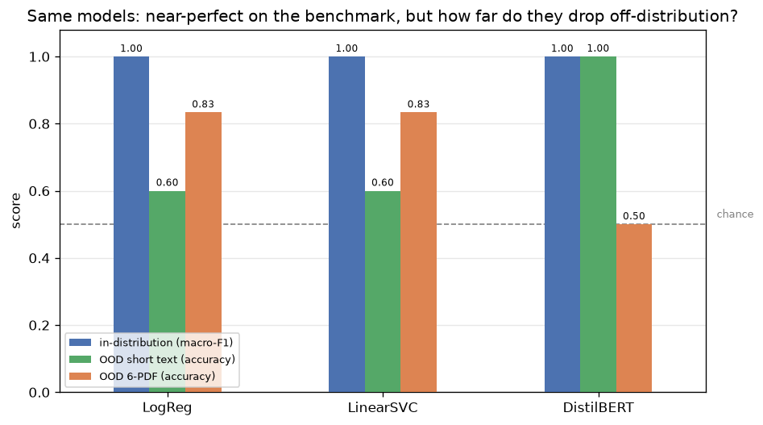

# Model Comparison — Classical vs Transformer

**SEA 820 · GenDetect (Detecting AI-Generated Text) · Cross-model synthesis**
Sources: [`classical_model/RESULTS_REPORT.md`](classical_model/RESULTS_REPORT.md) ·
[`transformer_model/`](transformer_model/) · OOD test: [`generalization_test/predict_demo.ipynb`](generalization_test/predict_demo.ipynb)

---

## A. Why does everyone get ~99.99%? (it's the dataset, not the model)

A near-perfect score is a **red flag, not a trophy**. Real AI-text detection is hard — commercial
detectors (GPTZero, Turnitin, Originality.ai) sit around 80–95% and are routinely fooled by
paraphrasing; academic out-of-distribution benchmarks show detectors collapsing to 50–70% on
unseen generators. So a TF-IDF + linear model scoring **99.99%** means the *task as posed is
trivial*, not that the model is exceptional.

**Why every Kaggle notebook, our two models, and other students all converge on the same number:**
the ceiling is a property of **how the dataset was built**, independent of whose code runs it.

- The Kaggle *AI vs Human Text* set = **human PERSUADE student essays** + **LLM text generated by a
  separate pipeline**. The two classes come from **two different sources**, not from "the same
  text, one human one AI."
- A classifier therefore never has to learn "AI-ness." It learns **which corpus a document came
  from** — via topic words (`venus`, `car`, `school`), redaction placeholders (`sincerely name`),
  and essay register (`additionally`, `firstly`).
- That signal is so strong even **Naive Bayes clears 97%**. When the simplest and the most complex
  models tie near 100%, the *task* is easy, not the classifier clever.

This is **not a bug in `data_processing`.** The one real bug we found — a mismatched-split leakage in
an early Transformer eval — was fixed (commit `63b831e`), and the number barely moved. If the score
came from a preprocessing leak, only *we* would hit 99.99%, not the whole internet. The score is
genuine **on this data** and non-transferable **off it** (see §B).

**Takeaway for the report:** don't chase a higher number. Report 99.99% as an *in-distribution
ceiling* and make **robustness / OOD the headline result**. "We showed the benchmark is saturated
and the score doesn't transfer" is a stronger, more honest finding than "we got 99.99%."

---

## B. Transformer vs Classical

### B.1 In-distribution (canonical 73,085-row test set — identical for both models)

Both models are scored by the **same** `metrics.py` on the **same** held-out test split
(`support_human=45,870`, `support_AI=27,215`), so this is a fair, leakage-free comparison.

| Model | Accuracy | Macro-F1 | Errors / 73,085 | Error split |
|---|---|---|---|---|
| **Classical — LinearSVC** ★ | 0.9997 | **0.9997** | **21** | 12 human→AI · 9 AI→human |
| Classical — LogReg | 0.9995 | 0.9995 | ~35 | — |
| **Transformer — DistilBERT** | 0.99958 | 0.99955 | 31 | 13 human→AI · 18 AI→human |

**The Transformer did not beat the baseline.** DistilBERT is ~0.0001 *lower* on macro-F1 and made
*more* errors (31 vs 21). On raw accuracy the two are **within noise** — exactly as predicted once
the dataset ceiling was understood. Spending a GPU to fine-tune a 66M-parameter model buys nothing
over a bag-of-words linear model *on this benchmark*, because the benchmark rewards a shortcut both
models can find.

### B.2 Out-of-distribution — the test that matters

Measured by [`generalization_test/predict_demo.ipynb`](generalization_test/predict_demo.ipynb)
(PDF numbers in [`ood_pdf_comparison.csv`](generalization_test/ood_pdf_comparison.csv)). Two OOD
probes: short informal text, and 6 real PDFs as `human_0X` / `ai_0X` pairs sharing a topic (so a
model reading *topic* instead of *authorship* gives the pair the **same** verdict).

| Test | LogReg | LinearSVC | **DistilBERT** |
|---|---|---|---|
| In-distribution test (macro-F1) | ~0.9995 | ~0.9997 | ~0.9995 |
| Short informal text (accuracy) | 3/5 = 60% | 3/5 = 60% | **5/5 = 100%** |
| 6 paired PDFs (accuracy) | **5/6 = 83%** | **5/6 = 83%** | **3/6 = 50% (chance)** |

 
All three tie at ~1.0 on the benchmark. Off-distribution they diverge: DistilBERT wins the
short-text probe (green) but collapses on the formal PDFs (orange); the linear baselines do the
opposite.

**The two OOD tests point in opposite directions — that divergence is the real finding.** Neither
model detects "AI-ness"; each keys on a *different* surface signal, so they fail on different inputs:

- **Short informal text — DistilBERT wins (100% vs 60%).** It correctly labels the two casual human
  messages *human* (96.7% / 99.6% human confidence), while **both classical models flag them as AI**
  (99.9% / 98.8%). TF-IDF sees none of its "human" artifact tokens (`venus`, `school`, redaction
  placeholders) in a ramen rant, so it defaults to AI. DistilBERT's subword features handle informal
  prose gracefully.
- **Formal PDFs — DistilBERT loses (50% vs 83%).** Here DistilBERT predicts **"AI" for all 6 docs**,
  including every human one, at **99.3–100% confidence**. It learned *"human" = PERSUADE student
  essay*, so polished published prose (public-domain literature, a pharmacology/history writeup)
  reads as AI. The **classical models separate the `public_domain` & `pharmacology` pairs correctly**
  (human→human, AI→AI) where DistilBERT calls both AI.
- **`aspirin_history` pair — everyone fails.** All three models call **both** the human and AI doc
  "AI." Pure topic shortcut, no authorship signal, for every model.

**Mechanism:** DistilBERT keys on **register/formality** (formal → AI, informal → human); the linear
models key on **topic/artifact tokens** (no known human tokens → AI). Both are proxies for the
*source distribution*, not for authorship — which is why each is confidently wrong on exactly the
inputs the other gets right.

> **Caveat — tiny samples.** 5 short texts and 6 PDFs (only 3 human, all formal prose). Treat every
> percentage as **indicative, not statistically definitive** — a handful of items can't pin an exact
> number. What *is* robust is the qualitative pattern: the two models fail in opposite directions,
> confirmed by both probes and the confidence values. A larger, mixed OOD set would be needed to
> quantify it.

### B.3 Verdict

- **On the benchmark:** three-way tie (~1.0). Capacity and simplicity are both irrelevant — the task
  is solved by a dataset artifact (§A).
- **In the wild:** there is **no overall winner** — it depends on the input. DistilBERT is more
  robust to *informal* text (100% vs 60%); the linear baselines are more robust to *formal* documents
  (83% vs 50%). Each fails confidently where the other succeeds.
- **Neither model detects authorship** — both detect *source distribution* via a different surface
  cue (register vs. topic tokens). The near-perfect benchmark number is a property of how the dataset
  was built, not evidence of a real detector.
- **Framing for submission:** *"High on the benchmark, unreliable in the wild — and the two models
  fail in opposite directions, which is itself the evidence that neither detects authorship."*

---

## C. Reproducibility notes

- Both models load the same canonical split from `data_processing/data/processed/` and are scored by
  the shared `classical_model/metrics.py` (`compute_metrics`).
- **Minor mismatch to fix:** `transformer_model/EXPERIMENT_LOG.md` lists the official final model
  (Run 2) at **LR 2e-5**, but committed `train_transformer.py` hard-codes `learning_rate=5e-5`.
  Set it back to `2e-5` (or add a note) so the script reproduces the reported `transformer_score.txt`.
- OOD comparison uses `transformer_text()` (= `basic_clean`, the model's training-time cleaning) for
  DistilBERT and `classical_preprocess(method='lemmatize')` for the classical models — each model
  sees text prepared exactly as it was trained.
