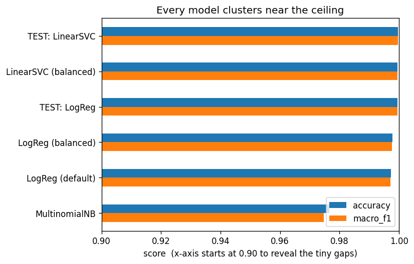
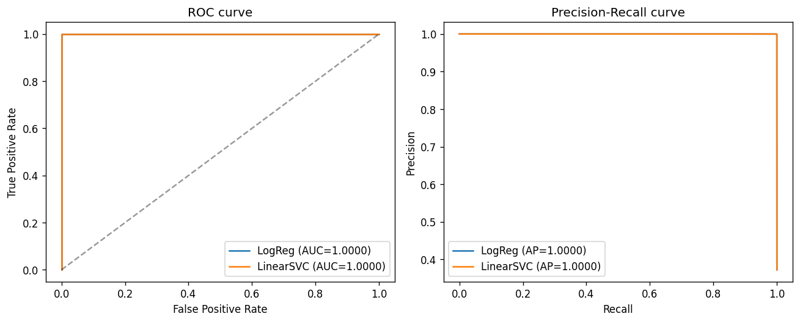
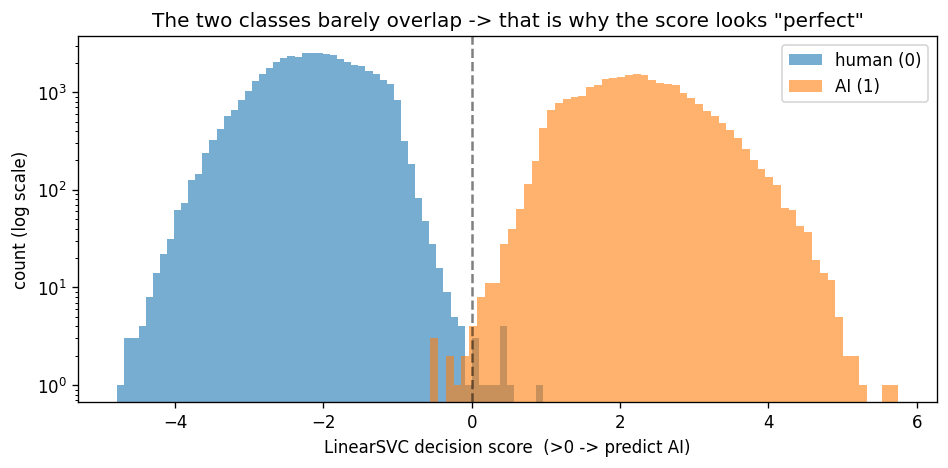
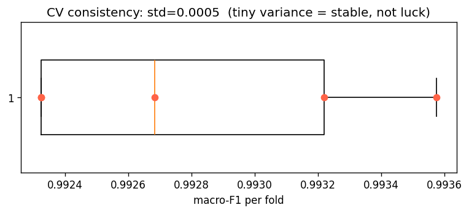
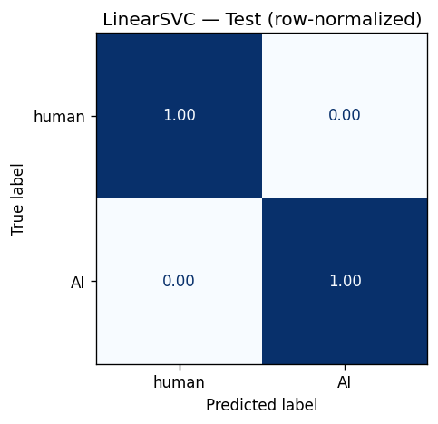
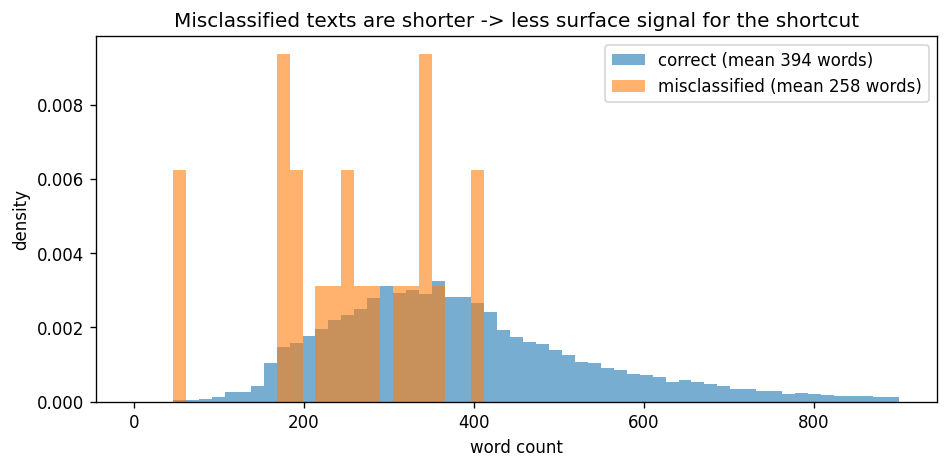

# Classical Baseline — Results & Interpretation

**SEA 820 · GenDetect (Detecting AI-Generated Text) · Part 2 (Member A)**
Source notebooks: [`train_baseline.ipynb`](train_baseline.ipynb) · [`predict_demo.ipynb`](predict_demo.ipynb)
Models & artifacts: [`classical_results/`](classical_results/)

---

## TL;DR

- The classical baseline (TF-IDF + linear classifier) reaches **99.97% macro-F1 on the held-out
  test set** — the number the Week-2 Transformer must beat.
- **This score is real on this dataset but not trustworthy in the real world.** The model wins by
  exploiting *dataset artifacts* (prompt-topic words, redaction placeholders, essay connectives),
  not by understanding "AI-ness."
- A generalization test on 6 real PDFs drops accuracy to **83% (5/6)**, and a short-text
  out-of-distribution probe collapses to **~50%**, where the model labels almost everything "AI"
  with ~100% confidence.
- **Takeaway:** report the baseline honestly as *high in-distribution, non-transferable*. The
  meaningful Week-2 comparison is robustness, not raw accuracy.

---

## 1. Experimental setup

| Item | Value |
|---|---|
| Dataset | Kaggle *AI vs Human Text* — 487,231 unique rows after cleaning |
| Class balance | 62.8% human (0) / 37.2% AI (1) — mild imbalance |
| Canonical split | Stratified 70/15/15 → train **341,061** · val **73,085** · test **73,085** (seed=42) |
| Model input | `text_classical` column (lowercased, de-punctuated, stop-word-removed, lemmatized) |
| Features | `TfidfVectorizer(ngram_range=(1,2), max_features=50,000, min_df=5, max_df=0.9, sublinear_tf=True)` → matrix `341,061 × 50,000`, density **0.387%** |
| + Engineered | log(char count) & log(word count) appended (`use_length=True`) |
| Metric | **Macro-F1** (headline, imbalance-aware) + per-class precision/recall |
| Protocol | Tune on **validation**; **test touched once**, at the end |

The split, cleaning, and features follow the "fit on train only" rule so no test vocabulary or
IDF statistics leak into training.

---

## 2. In-distribution results

### 2.1 Model comparison (validation)

| Model | Accuracy | Macro-F1 | AI recall |
|---|---|---|---|
| **LinearSVC** (balanced) | **0.9995** | **0.9995** | 0.9994 |
| LogReg (balanced) | 0.9977 | 0.9976 | 0.9961 |
| LogReg (default) | 0.9973 | 0.9971 | 0.9940 |
| MultinomialNB | 0.9765 | 0.9748 | 0.9585 |

Every model lands near the ceiling; even Naive Bayes clears 97%. When model choice barely moves
the needle, the **task is easy**, not the classifier clever — the first sign to be suspicious.

### 2.2 Tuning (selected on validation)

- **TF-IDF shape:** unigrams+bigrams `(1,2)` with `max_features=50,000` beat unigrams-only
  (0.9976 vs 0.9947); larger vocab gave no further gain.
- **Regularization:** `C=10` was best for both linear models.
- **Length features:** negligible for LogReg (dropped there), a hair positive for LinearSVC
  (`0.9998` kept) → `use_length=True`.

### 2.3 Final evaluation (test set — touched once)

| Model | Accuracy | Macro-F1 | AI P / R / F1 | Human F1 |
|---|---|---|---|---|
| **LinearSVC ★ (chosen)** | **0.9997** | **0.9997** | 0.9996 / 0.9997 / 0.9996 | 0.9998 |
| LogReg | 0.9995 | 0.9995 | 0.9993 / 0.9993 / 0.9993 | 0.9996 |

**Baseline = LinearSVC, macro-F1 0.9997.** Both classes score ~0.9996+, so the model is not
merely riding the majority class.

### 2.4 Cross-validation (stability check)

5-fold CV on a 30k stratified subsample: **[0.9932, 0.9927, 0.9923, 0.9923, 0.9936]**,
mean ≈ **0.9928**, std ≈ **0.0005**. The tiny variance confirms the score is *stable*, not a lucky
split — the model reliably finds the shortcut.

### 2.5 Diagnostic plots

<table>
<tr>
<td align="center"> All models cluster near the ceiling (x-axis from 0.90)</td>
<td align="center"> ROC & PR curves — AUC ≈ 1.0</td>
</tr>
<tr>
<td align="center"> Decision-score histogram — classes barely overlap</td>
<td align="center"> 5-fold CV — std ≈ 0.0005 (stable)</td>
</tr>
<tr>
<td align="center"> Confusion matrix (row-normalized) — test set</td>
<td></td>
</tr>
</table>

---

## 3. Interpretation — what the model actually learned

A near-perfect bag-of-words score is a **red flag**. The top coefficients reveal the model keys on
source/topic tells, not writing quality:

**LinearSVC — strongest "AI" words:** `essay, additionally, pursuing career, essential, firstly,
important, super, significant, sincerely name, conclusion, significant impact, another thing,
staying active, advertisement`

**LinearSVC — strongest "human" words:** `would, guidance expert, comfortable school, although,
people, venus, student, paragraph, reason` (LogReg adds `car, driving, percent, school, electoral`)

These fall into three artifact buckets:

1. **Placeholder / redaction tokens** — `sincerely name`, `student name`. The `name` token is a
   redacted-name placeholder that differs between the AI and human sources — a formatting tell.
2. **Prompt-topic words** — `venus`, `car`, `driving`, `school`, `percent`, `paragraph`,
   `electoral`. The human texts are the **PERSUADE student-essay corpus** (fixed prompts), so the
   model partly detects *which prompt set* a document came from.
3. **Essay-structure discourse markers** — `additionally`, `firstly`, `conclusion`, `essential`,
   `significant` — the polished LLM register.

A quick count found **9/50** of the strongest features are outright topic/placeholder artifacts;
most of the rest are register markers. Very little is a *universal* signal of machine generation.

---

## 4. Error analysis

- Only **21 errors out of 73,085** test rows: **12** human→AI (false positives), **9** AI→human.
- Misclassified texts are **shorter** (mean **258** words) than correctly classified ones
  (**394**). With fewer tokens there is less surface signal, so the shortcut breaks.
- Manual inspection: the misses are typically **OCR-garbled** texts ("8tX grader", "Xix school")
  where character corruption destroys the artifact tokens — direct confirmation the model leans on
  lexical surface cues.
- False positives = **humans flagged as AI**, mostly messy/non-standard writing — the ethically
  sensitive direction (see §7).

 Misclassified texts are shorter than correctly classified ones

---

## 5. Generalization test (`predict_demo.ipynb`)

The honest question: does 99.97% survive on text outside the training distribution? We loaded the
saved models and applied the **same preprocessing**, exposing an AI% / human% via LogReg
`predict_proba` (LinearSVC uses a sigmoid-of-margin approximation).

### 5.1 Real PDFs — paired human/AI on the same 3 topics

| File | Topic | True | LogReg | AI% | human% | LinearSVC | AI% | human% |
|---|---|---|---|---|---|---|---|---|
| human_01_public_domain | public_domain | human | human ✓ | 14.7 | 85.3 | human ✓ | 34.4 | 65.6 |
| ai_01_public_domain | public_domain | AI | AI ✓ | 99.8 | 0.2 | AI ✓ | 84.3 | 15.7 |
| human_02_aspirin_pharmacology | pharmacology | human | human ✓ | 38.4 | 61.6 | human ✓ | 36.0 | 64.0 |
| ai_02_aspirin_pharmacology | pharmacology | AI | AI ✓ | 94.7 | 5.3 | AI ✓ | 64.6 | 35.4 |
| **human_03_aspirin_history** | history | human | **AI ✗** | 97.9 | 2.1 | **AI ✗** | 66.9 | 33.1 |
| ai_03_aspirin_history | history | AI | AI ✓ | 97.1 | 2.9 | AI ✓ | 66.8 | 33.2 |

**Accuracy: 5/6 = 83%** (both models) — down from 99.97% in-distribution.

The **`aspirin_history` pair is the smoking gun**: the human and AI documents on the same topic get
the *same* verdict at nearly identical confidence (97.9% vs 97.1% AI under LogReg). Same topic →
same prediction → the model is reading **topic/format, not authorship**.

### 5.2 Short informal text

On a small probe of casual/news snippets, the model labelled **nearly everything "AI"** — including
a human's typo-filled message — at up to **100% confidence**, scoring around **50%**. Short OOD text
lacks the artifact tokens, so the model defaults toward "AI." This also shows the probabilities are
**badly calibrated**: because the training data is trivially separable, outputs pile up near 0% and
100% and rarely give an informative middle value.

---

## 6. Diagnostics summary

| Check | Result | Reading |
|---|---|---|
| ROC / PR AUC | ≈ 1.0 | Near-perfect separability **on this data** (genuine here) |
| Decision-score histogram | Two classes barely overlap | *Why* the score looks perfect |
| 5-fold CV | mean 0.993, std 0.0005 | Stable, not a lucky split |
| Model spread | all ≥ 0.97 | Task is easy, not model clever |
| OOD (PDF / short text) | 83% / ~50% | The score does **not** transfer |

---

## 7. Ethics & limitations

- **The score is inflated by dataset construction.** Human = PERSUADE student essays; AI = LLM text
  from a different pipeline. A linear model separates the *sources*, not the *nature* of the text.
- **False-positive harm:** the model tends to flag formal, clean, or (conversely) messy/garbled
  writing as AI. In deployment this would disproportionately mislabel **careful or non-native
  writers** as AI — a real fairness risk, consistent with the EDA's ethics flag.
- **Poor calibration:** the AI% / human% numbers should not be shown to users as a reliable
  "how-AI-is-this" meter.
- **No out-of-domain guarantee:** performance is only demonstrated on the PERSUADE-vs-AI-essay
  distribution.

---

## 8. Implications for Week 2 (Transformer)

Because the in-distribution ceiling is ~99.97%, **DistilBERT will very likely also score ~99%** on
the same test set. "Did the Transformer beat the baseline?" will therefore be **within noise** on
raw accuracy. The genuinely informative comparison is **robustness / out-of-distribution**: re-run
`predict_demo.ipynb`'s PDF and short-text tests on the Transformer and compare *generalization*, not
just the headline metric. Member B should know this before framing the comparison.

---

## 9. Reproducibility

| Artifact | Location |
|---|---|
| Training + diagnostics | `train_baseline.ipynb` |
| Generalization demo | `predict_demo.ipynb` |
| Saved models | `classical_results/models/` (`tfidf_vectorizer`, `LogReg`, `LinearSVC`, `config`) |
| Metrics / plots | `classical_results/` |
| Chosen config | LinearSVC · `C=10` · `class_weight='balanced'` · TF-IDF `(1,2)`, `max_features=50,000` · `use_length=True` |

Shared modules: `tfidf_features.py` (features, no-leakage fit) and `metrics.py` (scoring — reused
by Member B for a fair comparison). All runs use `random_state=42`.

---

## 10. Conclusion

The classical baseline achieves **macro-F1 0.9997** on the held-out test set — a strong headline
number, and a valid target for the Transformer. But the interpretation, error analysis, and
generalization tests together show that number is a **shortcut**: the model separates *data
sources*, not *human vs. machine writing*, and it does not transfer (83% on real PDFs, ~50% on
short OOD text). The honest framing for the report is:

> *"High on the benchmark, unproven in the wild."*

That distinction — and the concrete `aspirin_history` failure — is the most valuable finding of
Part 2.
